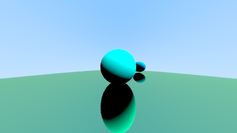

# Lua-Raytracer
This is a Raytracer made in lua that utilizes object oriented programming
It can create 3D spheres utilizing diffused shading and metalic surfaces that imulate refelction. 

3D scenes are rendered into a ppm file as output.

Run the main.lua script to implement the Raytracer. The program will the user to either run a preset 3D scene:
  type in the response 'y' or 'yes' if you want to run it or 'n' or 'no'. 
  
this is the output of the preset scene

  
If you say no, then you will get the ability to set up the camera look-at point, field of view angle, and the position of a white light light source the scene. After setting up the camera the script will then prompt you for more input commands. overall I implemented 4 functions: draw, sphere, clear, and exit

Draw: this command renders the scene. on my end it took about 30 seconds to render the pre-set scene which has 3 objects. The speed might get slower if there's more objects added into the scene! Once its done rendering the program will print the message "completed output ppm file: scene.ppm" to let you know that the scene has been made/updated. You can call this multiple times especially when you add in new objects. The output file of the custome scene is scene.ppm

Sphere: This function prompts the player to create a sphere object into the scene: you are first prompted to set up the (x,y,z) cordinates of the center the sphere(where its located), set up the radius, set up the color in rgb values, and then you're finally prompted if your sphere is metalic and is mirror-like.

clear: this function clears the eobjects you created for the scene.

exit or done: either of these commands will allow you to exit the program when your done
